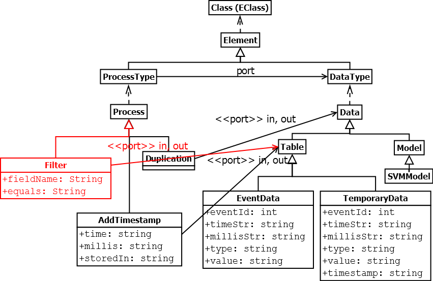
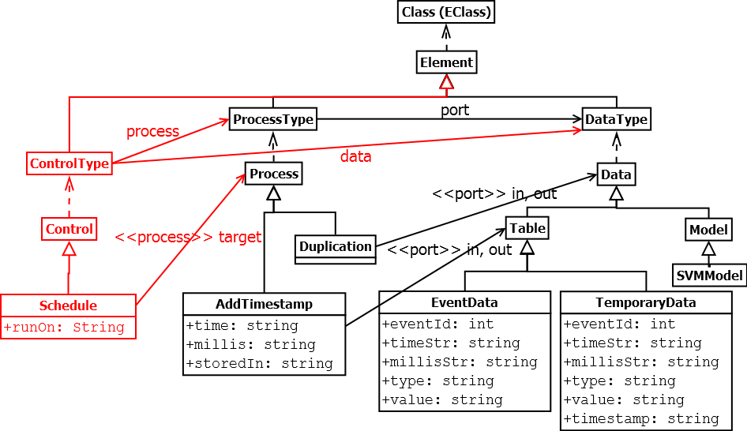

# dataflow-mlm

A dataflow model defined by EMF, Melanee and MetaDepth.
This is used for evaluating capability for modeling and extensibility of each framework.

# Overview of the dataflow model

# V1: as is

## Files

- emf/mlm.dataflow.ecore/model/v1/{M1.xmi,M2.ecore,M3.ecore}
- melanee/dataflow_v1.lml
- metadepth/dataflow_v1.mdepth

# V2: adding a new process type

- emf/mlm.dataflow.ecore/model/v2/{M1.xmi,M2.ecore,M3.ecore}
- melanee/dataflow_v2.lml
- metadepth/dataflow_v2.mdepth

# V3: adding a new conceptual type

## Files

- emf/mlm.dataflow.ecore/model/v3/{M1.xmi,M2.ecore,M3.ecore}
- melanee/dataflow_v3.lml
- metadepth/dataflow_v3.mdepth

